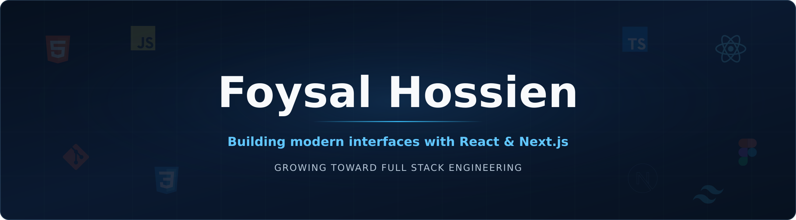

  

  I build responsive frontend experiences with clear structure, reusable components, and thoughtful user interactions.

 

## About Me

My route into software development did not follow the path I initially expected. I wanted to study Computer Science, but completed a Diploma in Electrical and Electronics Engineering from Dhaka Polytechnic Institute. That journey strengthened my technical mindset, while software remained the career I wanted to pursue.

My interest in coding became serious when I saw how software could turn an idea into a working product. I started with web fundamentals, built a strong foundation in HTML, CSS, JavaScript, TypeScript, asynchronous JavaScript, Tailwind CSS, and Git, and then moved into React and Next.js.

Today, I improve through practical projects. My current priority is mastering React and Next.js before expanding into backend development and the wider full stack ecosystem.

 

## Current Direction

<table>
  <tr>
    <td width="190"><strong>Current work</strong></td>
    <td>Building practical React and Next.js projects with complete and responsive user experiences</td>
  </tr>
  <tr>
    <td><strong>Improving</strong></td>
    <td>Component architecture, state management, routing, responsive design, and accessibility</td>
  </tr>
  <tr>
    <td><strong>Exploring</strong></td>
    <td>Modern React patterns, Next.js application structure, and stronger TypeScript usage</td>
  </tr>
  <tr>
    <td><strong>Next direction</strong></td>
    <td>Backend development after establishing a strong frontend foundation</td>
  </tr>
  <tr>
    <td><strong>Open to</strong></td>
    <td>Collaborating on meaningful React and Next.js projects with a clear purpose</td>
  </tr>
</table>

 

## Technologies

<strong>Core Foundations</strong>

  

<strong>Current Stack</strong>

  

<strong>Tools and Workflow</strong>

  

 

## What I Build

<table>
  <tr>
    <td width="33%" align="center">
      <strong>Responsive Interfaces</strong>
       
      Layouts that remain clear and usable across different screen sizes
    </td>
    <td width="33%" align="center">
      <strong>Reusable Components</strong>
       
      Focused components that keep the interface consistent and maintainable
    </td>
    <td width="33%" align="center">
      <strong>Complete User Flows</strong>
       
      Connected experiences that guide users from one action to the next
    </td>
  </tr>
</table>

 

## How I Work

<table>
  <tr>
    <td width="25%" align="center">
      <strong>Understand</strong>
       
      Clarify the goal
    </td>
    <td width="25%" align="center">
      <strong>Structure</strong>
       
      Plan the components
    </td>
    <td width="25%" align="center">
      <strong>Build</strong>
       
      Develop in small steps
    </td>
    <td width="25%" align="center">
      <strong>Refine</strong>
       
      Review every detail
    </td>
  </tr>
</table>

 

## What I Value

<table>
  <tr>
    <td width="33%" align="center">
      <strong>Clarity</strong>
       
      Code and interfaces should be easy to understand
    </td>
    <td width="33%" align="center">
      <strong>Consistency</strong>
       
      Small improvements practiced regularly create lasting progress
    </td>
    <td width="33%" align="center">
      <strong>Purpose</strong>
       
      Every feature should solve a real problem for its user
    </td>
  </tr>
</table>

 

## Beyond Development

I enjoy exploring modern technology and traveling to new places. Both keep me curious, introduce me to different perspectives, and help me return to my work with fresh ideas.

 

## Connect with Me

  
  
  
  

 

## GitHub Activity

  <picture>
    <source
      media="(prefers-color-scheme: dark)"
      srcset="https://streak-stats.demolab.com?user=foysaliio&amp;hide_border=true&amp;background=0D1117&amp;stroke=30363D&amp;ring=58A6FF&amp;fire=58A6FF&amp;currStreakLabel=58A6FF&amp;sideLabels=C9D1D9&amp;dates=8B949E&amp;currStreakNum=F0F6FC&amp;sideNums=F0F6FC"
    />
    <source
      media="(prefers-color-scheme: light)"
      srcset="https://streak-stats.demolab.com?user=foysaliio&amp;hide_border=true&amp;background=FFFFFF&amp;stroke=D0D7DE&amp;ring=0969DA&amp;fire=0969DA&amp;currStreakLabel=0969DA&amp;sideLabels=57606A&amp;dates=6E7781&amp;currStreakNum=24292F&amp;sideNums=24292F"
    />
    
  </picture>

 

## Activity Overview

  <picture>
    <source
      media="(prefers-color-scheme: dark)"
      srcset="https://github-profile-summary-cards.vercel.app/api/cards/profile-details?username=foysaliio&amp;theme=github_dark"
    />
    <source
      media="(prefers-color-scheme: light)"
      srcset="https://github-profile-summary-cards.vercel.app/api/cards/profile-details?username=foysaliio&amp;theme=default"
    />
    
  </picture>

 

  Building with purpose, learning through practice, and improving with every project.

